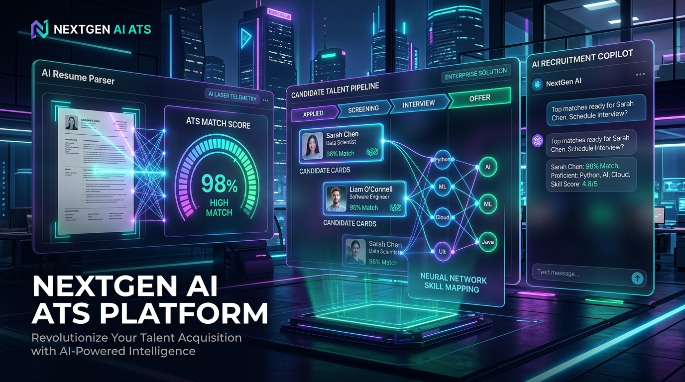

# NextGen AI ATS — Intelligent Recruitment & Applicant Tracking Platform



> **Enterprise-grade Intelligent Applicant Tracking System & Recruitment Suite with AI-Driven ATS Score Modeling, Resume Entity Extraction, Recruiter Pipeline Kanban, TalentPilot Copilot, and Multi-Role Governance.**

---

## 📌 Project Overview

**NextGen AI ATS** is a full-stack, enterprise-grade recruitment platform engineered for modern talent acquisition teams, recruitment agencies, and job candidates. It bridges the gap between candidate resume optimization and recruiter talent screening by providing real-time ATS match scoring, automated entity extraction, applicant pipeline tracking, AI assistant copilot, and administrative governance.

---

## ⚡ Tech Stack Architecture

### 🌐 Frontend (`/frontend`)
- **Framework**: React 19 + TypeScript + Vite
- **Styling**: Tailwind CSS + Custom Design Tokens + Glassmorphism + Dynamic Glow Accents
- **Icons**: Lucide React
- **Routing**: React Router v7
- **State & Context**: AuthContext, ToastContext, Role Switching
- **HTTP Client**: Typed API client with automatic JWT token management & fallback resiliency

### ⚙️ Backend (`/backend`)
- **Framework**: Spring Boot 3.3.4 (Java 21)
- **Database**: PostgreSQL with Hibernate / Spring Data JPA
- **Security**: Spring Security 6 with JWT Token Provider & Role-Based Access Control (RBAC)
- **Document Extraction**: Apache PDFBox 3.0.3 & Apache POI 5.3.0 for PDF/DOCX Resume Parsing
- **Email Service**: Spring Boot Mail (SMTP / Gmail App Password) for transactional verification & password reset
- **AI Engine**: Google Gemini API integration for TalentPilot Recruitment Copilot

---

## 🎯 Multi-Role Architecture

The platform provides dedicated, custom-tailored interfaces for three core personas:

### 1. 👨‍💻 Candidate Portal
- **Dashboard**: ATS benchmark gauge, profile completion progress, recommended jobs carousel, and live application timeline.
- **Candidate Profile Management**: Multi-section editor for Personal Info, Technical/Soft Skills tags, Education, Work History, Featured Projects, and Certifications.
- **Resume Management**: Drag-and-drop file uploader (PDF/DOCX), format validator, primary resume switcher, and preview modal.
- **AI Resume Parser**: Multi-phase visual entity extractor with laser scan line animation that syncs extracted entities directly to the candidate profile.
- **ATS Analysis & Feedback**: Radial gauge score analyzer (overall + technical score), score vector breakdown (Keywords, Skills, Experience, Education, Formatting), missing keyword cloud, and strengths/weaknesses insights.
- **Job Discovery & Recommendations**: Multi-faceted filter system (Department, Experience Level, Job Type, Min Match %) with 1-click **Easy Apply** modal.
- **Application Tracker**: Visual pipeline tracker with milestone dates and recruiter notes.

### 2. 🏢 Recruiter Portal
- **Recruiter Command Center**: Metrics for Active Jobs, Total Applicants, In Interview, and Hires This Month.
- **Company Profile Branding**: Employer logo, tagline, mission description, and benefits/perks editor.
- **Job Requisition Management**: Active/closed toggles, applicant counts, and delete actions.
- **Post New Job Wizard**: Multi-section requisition builder with salary ranges, requirements, and skill tags for ATS matching.
- **Applicant Pipeline & Screening**: Dual **Kanban Pipeline Board** and **Table View** with ATS score sorting, resume reviews, status transitions, and recruiter evaluation notes.

### 3. 🛡️ Administrator Governance
- **System Overview**: Platform KPIs (total candidates, recruiters, placement rate, system health).
- **User Account Management**: Search, filter, and 1-click suspend/activate account actions.
- **Recruiter Verification**: Verify legitimate employer organizations to safeguard candidate data.
- **Job Moderation**: Audit and approve/remove job postings.
- **Platform Analytics**: Visual recruitment funnel conversions and top in-demand technical skills breakdown.
- **Security Access Passkeys**: Authorized keys (`ADMIN2026`, `admin123`) with instant auto-fill and validation.

---

## 📁 Repository Structure

```
.
├── backend/                  # Java Spring Boot 3 Backend
│   ├── src/main/java/com/aiats/
│   │   ├── config/           # Security, CORS, DataInitializer
│   │   ├── controller/       # Auth, Candidate, Recruiter, Admin, Job, Copilot
│   │   ├── dto/              # Request / Response Data Transfer Objects
│   │   ├── entity/           # JPA Entities (User, Job, Application, Resume, etc.)
│   │   ├── repository/       # Spring Data JPA Repositories
│   │   └── service/          # Business logic, AI parsing, JWT token generation
│   ├── src/main/resources/   # application.properties & database schemas
│   ├── .env.example          # Sample environment configuration template
│   └── pom.xml               # Maven dependencies configuration
├── frontend/                 # React 19 + TypeScript + Vite Frontend
│   ├── src/
│   │   ├── components/       # UI & common layout elements
│   │   ├── context/          # AuthContext, ToastContext
│   │   ├── pages/            # Candidate, Recruiter, Admin, Public, Auth pages
│   │   ├── routes/           # Centralized Route hierarchy
│   │   ├── services/         # API clients with JWT token handlers
│   │   └── types/            # TypeScript entity models
│   ├── package.json
│   └── vite.config.ts
├── .gitignore                # Production ignore rules
└── README.md
```

---

## 🚀 Quick Setup & Run Instructions

### 1. Database Setup (PostgreSQL)
Create a PostgreSQL database named `ai_ats_db`:
```sql
CREATE DATABASE ai_ats_db;
```

### 2. Configure Backend Environment
Copy the example environment template in `backend/`:
```bash
cp backend/.env.example backend/.env
```
Update your PostgreSQL credentials, JWT secret, and optional Gmail SMTP / Gemini API keys in `backend/.env`.

### 3. Run Backend (Spring Boot)
```bash
cd backend
mvn clean compile
mvn spring-boot:run
```
Backend runs at `http://localhost:8080`.

### 4. Run Frontend (React + Vite)
In a separate terminal:
```bash
cd frontend
npm install
npm run dev
```
Frontend runs at `http://localhost:5173`.

---

## 🔑 Default Credentials & Quick Login

| Role | Email | Password |
|---|---|---|
| **Candidate** | `karishma681shaik@gmail.com` | `Password123!` |
| **Recruiter** | `talent@coursera.org` | `Password123!` |
| **Administrator** | `admin@ai-ats.internal` | `Password123!` |

*(Admin registration passkey: `ADMIN2026` or `admin123`)*

---

## 📄 License
This project is licensed under the MIT License.
